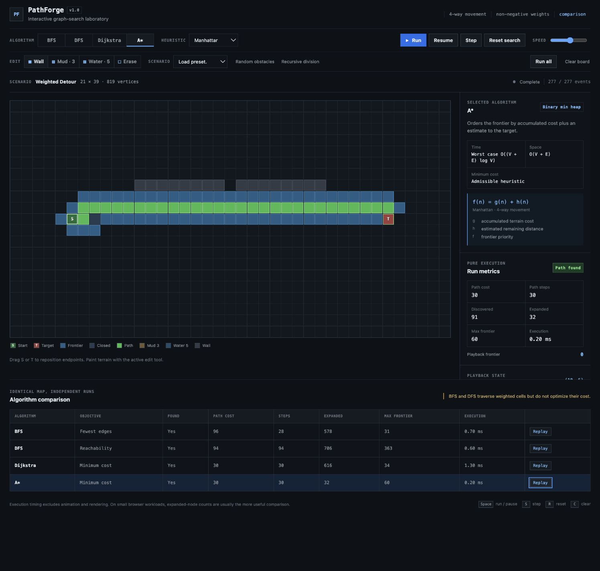

# PathForge

PathForge is an interactive graph-search laboratory for visualizing and comparing BFS, DFS, Dijkstra and A* on weighted grid environments.

The algorithms run independently from React. Each run produces a typed event log and structural metrics; the playback layer consumes that log later for animation, pause, replay, and expansion-level stepping.



## Why I built it

I wanted to compare more than the final paths. Two algorithms can both reach a target while doing substantially different work, and a path with fewer edges is not necessarily cheaper on weighted terrain. PathForge makes discovery order, expansion order, frontier growth, path cost, and A* heuristic behavior inspectable under the same map.

The repository is also structured so the algorithm code can be discussed and tested without involving the UI.

## Features

- Paint walls, mud (cost 3), and water (cost 5); erase terrain or drag the start and target.
- Run, pause, resume, reset, or step through one complete node expansion at a time.
- Inspect a node's state, parent, level, distance, or `g`/`h`/`f` values as appropriate.
- Run all four algorithms immediately on an unchanged grid, then replay any recorded run.
- Load five deterministic scenarios: Open Field, Weighted Detour, Narrow Maze, Dense Obstacles, and No Path.
- Generate random-obstacle boards or recursive-division mazes.
- Use Manhattan or Euclidean distance with A*.
- Use keyboard shortcuts: `Space` run/pause, `S` step, `R` reset search, and `C` clear board.

## Algorithms

All graph-search implementations and their data structures live in this repository.

| Algorithm | Frontier | Time | Path guarantee on this grid |
| --- | --- | --- | --- |
| BFS | Head-index queue | `O(V + E)` | Fewest edges when edge costs are equal |
| DFS | Explicit stack | `O(V + E)` | Reachability; no shortest-path guarantee |
| Dijkstra | Binary min heap | `O((V + E) log V)` | Minimum cost for non-negative weights |
| A* | Binary min heap | Worst case `O((V + E) log V)` here | Minimum cost with the provided admissible heuristics |

DFS pushes neighbors in reverse of the shared `up, right, down, left` order so the stack expands them deterministically. Dijkstra and A* use duplicate heap insertion instead of decrease-key; stale entries are discarded when popped.

## Comparing results

`Run all` executes BFS, DFS, Dijkstra, and A* without animation and fills a shared comparison table:

- path found
- path cost
- path length in edges
- nodes discovered and expanded
- maximum logical frontier size
- pure execution time

BFS optimizes the number of edges, DFS does not optimize the returned path, and Dijkstra/A* optimize accumulated terrain cost. PathForge still reports the actual terrain cost of BFS/DFS paths, but labels their objectives separately and shows a warning when weighted terrain is present.

## Architecture

```text
Grid domain model
      ↓
Pure algorithm engine
      ↓
SearchResult + SearchEvent[]
      ↓
Playback reducer / cursor
      ↓
React visualization and inspector
```

Algorithms use local mutable arrays, maps, sets, queues, and heaps because those structures are appropriate during a search. The input grid is not mutated, and the result crosses the engine boundary as plain data. React owns the editable grid reference, the selected result, and playback state; it never participates in the algorithm loop.

See [DESIGN.md](DESIGN.md) for the domain and correctness decisions in more detail.

## Search events and playback

The event model is a discriminated union:

- `discovered`: a node enters the logical frontier for the first time
- `expanded`: a node is selected for neighbor processing
- `relaxed`: a weighted edge produces a better score/parent
- `closed`: expansion of a node is complete
- `path`: one coordinate in the reconstructed final path

Events include the coordinate, current logical frontier size, and only the values meaningful to that operation. The playback reducer folds events into a `Map<coordinateKey, PlaybackNode>`; it does not clone the terrain grid. Automatic playback batches a small number of events per frame. Manual `Step` advances through the next `expanded … closed` group, so a step represents algorithm work rather than one arbitrary visual frame.

## A* heuristics

PathForge uses four-directional movement and charges the cost of entering the destination cell. Every traversable terrain cost is at least 1.

```text
f(n) = g(n) + h(n)
```

- `g` is the accumulated terrain cost from the start.
- `h` is Manhattan or Euclidean distance to the target.
- `f` is the heap priority.

With four-directional unit-distance moves and minimum terrain cost 1, both provided heuristics are admissible and consistent. The test suite also runs A* with `h(n) = 0` and verifies that its optimal cost matches Dijkstra.

## Weighted-grid behavior

Normal terrain costs 1, mud costs 3, water costs 5, and walls are impassable. A path's cost excludes the start and includes every cell entered afterward.

Negative costs cannot be represented by the terrain model and unknown terrain values fail validation. Dijkstra and A* minimize this accumulated cost. BFS and DFS use the same traversability graph but do not use the weight during frontier ordering.

## Testing strategy

Vitest tests the algorithm layer without rendering React. Coverage includes:

- heap ordering, duplicates, empty behavior, and a custom comparator
- BFS shortest routes, obstacles, failure, and `start === target`
- DFS reachability, cycles, and failure
- Dijkstra weighted detours, failure, and terrain validation
- A* open fields, obstacles, weighted grids, failure, `start === target`, and zero heuristic
- path endpoints, legal adjacency, wall avoidance, and recomputed cost
- deterministic seeded weighted grids where A* must match Dijkstra for every reachable case
- playback reduction and expansion-step boundaries
- deterministic presets and maze-generator invariants

Browser timing on small grids is noisy. The application measures pure algorithm execution, including result/event construction but excluding playback and rendering. Structural metrics—especially expanded nodes—are usually more informative for comparisons.

## Local setup

Requires Node.js 22.13 or newer.

```bash
npm install
npm run dev
```

Useful checks:

```bash
npm test
npm run typecheck
npm run lint
npm run build
```

## Project structure

```text
src/
  algorithms/      BFS, DFS, Dijkstra, A*, heuristics, result/event types
  structures/      MinHeap and head-index Queue
  core/            grid model, neighbors, path reconstruction and validation
  playback/        pure event reducer and playback state
  mazes/           presets, seeded random obstacles, recursive division
  components/      grid, toolbar, metrics, algorithm, inspector, comparison UI
  hooks/           playback timing and cursor controller
  tests/           algorithm, structure, playback, and generator tests
app/                application entry and CSS
docs/               repository screenshot
```

## Design decisions and tradeoffs

- Four-directional movement keeps the initial heuristic contract precise and avoids hiding corner-cutting rules inside a UI toggle.
- The heap intentionally has no decrease-key operation. Duplicate insertions keep the generic heap API small; algorithms reject stale entries on pop.
- Maximum frontier size measures the logical open set, not stale heap entries. That makes the cross-algorithm metric describe pending nodes rather than an implementation artifact.
- The event log increases memory use relative to a metrics-only run, but enables deterministic replay and keeps timing/rendering out of the algorithms.
- `Run all` records four event logs instead of animating four grids simultaneously. This uses more memory but makes comparison and replay easier to read.
- Terrain is a flat array for predictable indexing. UI edits copy that array; search runs allocate their own score/state structures.

## Limitations

- Movement is four-directional; diagonal cost, octile distance, and corner-cutting rules are not implemented.
- Event logs scale with the number of search operations and are retained for all four comparison runs.
- Runtime measurements are browser-local observations, not scientific benchmarks.
- Boards are device-local and are not persisted or shared.

## Potential future work

- Previous-expansion stepping using periodic playback checkpoints
- Optional eight-directional movement with octile distance and explicit corner rules
- Export/import for deterministic board fixtures
- A metrics-only mode that omits the event log for larger benchmark sweeps

